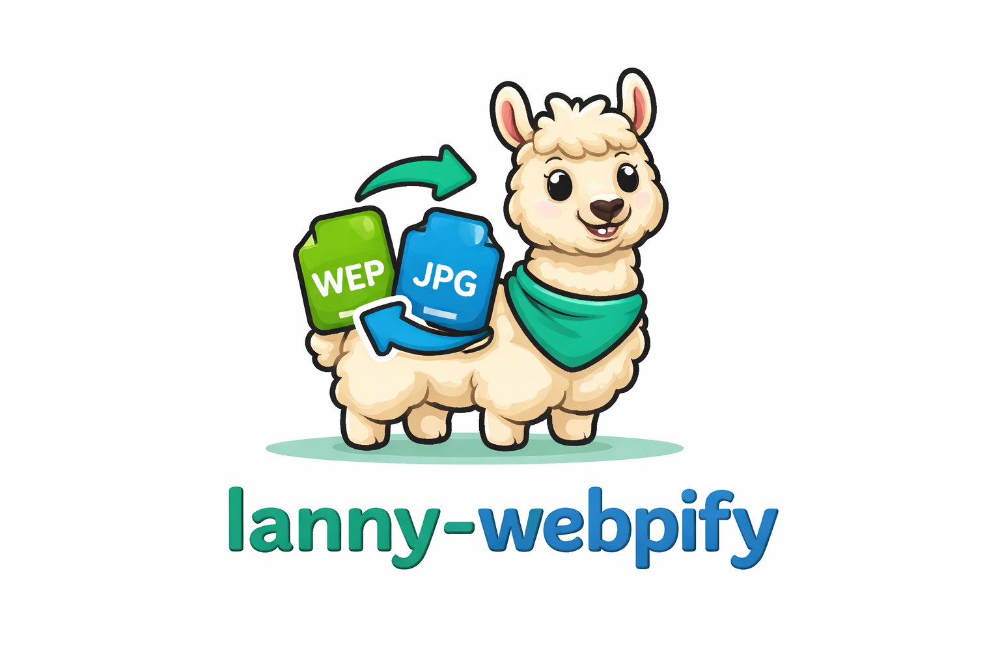

<p align="center">
  
</p>

# Lanny Webpify

A lightweight PHP microservice for converting media files to and from WebP format. Built with Slim Framework 4, this service handles both static images and animated WebP files, converting them to appropriate formats (JPEG for static, MP4 for animated) and vice versa.

## ✨ Features

- **WebP to Media** - Convert WebP images to JPEG (static) or MP4 (animated)
- **Media to WebP** - Convert images and videos to WebP format
- **AWS S3 Integration** - Automatically uploads converted files to S3 and returns pre-signed URLs
- **Docker Ready** - Includes Dockerfile for easy containerized deployment
- **ImageMagick & FFmpeg** - Powered by industry-standard media processing libraries

## 🚀 Getting Started

### Prerequisites

- PHP 8.2+
- Composer
- Docker (optional, for containerized deployment)
- AWS S3 bucket and credentials
- ImageMagick extension
- FFmpeg

### Installation

1. **Clone the repository**

   ```bash
   git clone https://github.com/h1rdr3v2/lanny-webpify.git
   cd lanny-webpify
   ```

2. **Install dependencies**

   ```bash
   composer install
   ```

3. **Configure environment variables**

   ```bash
   cp .env.example .env
   ```

   Edit `.env` with your AWS credentials and configuration.

4. **Run the application**

   **Using PHP built-in server:**

   ```bash
   php -S localhost:8000 -t public
   ```

   **Using Docker:**

   ```bash
   docker build -t lanny-webpify .
   docker run -p 8080:80 --env-file .env lanny-webpify
   ```

## 📡 API Endpoints

### Convert Media to WebP

Converts images (JPEG, PNG, GIF) and videos (MP4, WebM) to WebP format.

```
POST /mediatowebp
```

**Request Body:**

```json
{
	"url": "https://example.com/image.jpg"
}
```

**Response:**

```json
{
	"url": "https://s3.amazonaws.com/bucket/converts/abc123.webp"
}
```

### Convert WebP to Media

Converts WebP files to JPEG (static images) or MP4 (animated WebP).

```
POST /webptomedia
```

**Request Body:**

```json
{
	"url": "https://example.com/image.webp"
}
```

**Response:**

```json
{
	"url": "https://s3.amazonaws.com/bucket/converts/abc123.jpg"
}
```

> **Note:** Animated WebP files are automatically detected and converted to MP4 format.

### Optional: Custom Headers

If the source URL requires authentication or custom headers, you can pass them in the request:

```json
{
	"url": "https://protected-cdn.com/image.jpg",
	"headers": {
		"Authorization": "Bearer your-token",
		"X-Custom-Header": "value"
	}
}
```

These headers are forwarded when fetching the source media file.

## ⚙️ Configuration

The service is configured via environment variables:

| Variable                | Description                                | Default     |
| ----------------------- | ------------------------------------------ | ----------- |
| `AWS_DEFAULT_REGION`    | AWS region for S3                          | `us-east-1` |
| `AWS_ACCESS_KEY_ID`     | AWS access key ID                          | -           |
| `AWS_SECRET_ACCESS_KEY` | AWS secret access key                      | -           |
| `S3_BUCKET_NAME`        | S3 bucket name for storing converted files | -           |

## 🐳 Docker Deployment

The included Dockerfile sets up a complete environment with:

- PHP 8.2 with Apache
- ImageMagick extension
- GD library with WebP support
- FFmpeg for video processing

```bash
# Build the image
docker build -t lanny-webpify .

# Run the container
docker run -d \
  -p 8080:80 \
  -e AWS_DEFAULT_REGION=us-east-1 \
  -e AWS_ACCESS_KEY_ID=your_key \
  -e AWS_SECRET_ACCESS_KEY=your_secret \
  -e S3_BUCKET_NAME=your_bucket \
  lanny-webpify
```

## 📁 Project Structure

```
lanny-webpify/
├── config/
│   └── definitions.php    # DI container definitions
├── public/
│   └── index.php          # Application entry point
├── src/
│   ├── Controllers/
│   │   └── MediaProcessingController.php
│   ├── Middlewares/
│   │   └── JsonResponseMiddleware.php
│   ├── Services/
│   │   └── MediaProcessingService.php
│   └── routes.php         # API routes
├── images/                # Project images/logo
├── .env.example           # Environment variables template
├── .gitignore
├── composer.json
├── Dockerfile
└── README.md
```

## 🛠️ Tech Stack

- **Framework:** [Slim Framework 4](https://www.slimframework.com/)
- **Dependency Injection:** [PHP-DI](https://php-di.org/)
- **AWS SDK:** [AWS SDK for PHP](https://aws.amazon.com/sdk-for-php/)
- **HTTP Client:** [Guzzle](https://docs.guzzlephp.org/)
- **Image Processing:** ImageMagick, GD
- **Video Processing:** FFmpeg

## 📄 License

This project is open-sourced software.

## 👤 Author

**h1rdr3v2** - [ezenwatairoegbu97@gmail.com](mailto:ezenwatairoegbu97@gmail.com)
